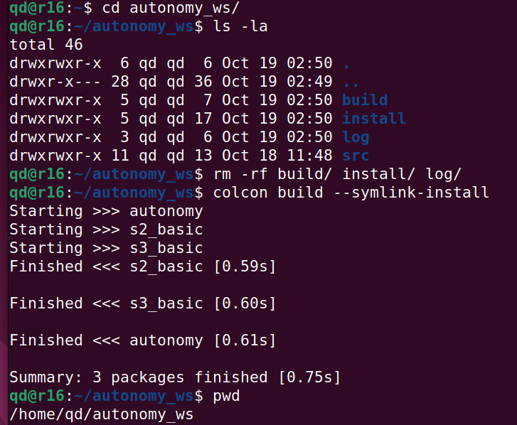

# We Build Autonomous Robots




### Setup ROS2 and ASL packages 

- [Setup ROS2 and ASL packages instruction](https://github.com/StanfordASL/asl-tb3-utils)
- Have below bash commands at the end of `~/.bashrc` 


```bash
source /opt/ros/humble/setup.bash
source $HOME/tb_ws/install/local_setup.bash
alias update_tb_ws=$HOME/tb_ws/src/asl-tb3-utils/scripts/update.sh
```

### Commands to build our autonomy ROS2 workspace


```bash
cd ~ && rm -rf ~/autonomy_ws
mkdir ~/autonomy_ws && cd ~/autonomy_ws
git clone git@github.com:QuangMDoan/autonomy.git src
colcon build --symlink-install
```